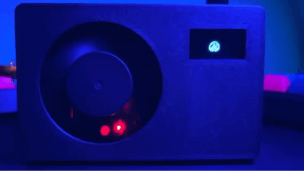

<h1>ORANGE PI  5 CASE</h1>

## About

This is a case for the Orange Pi 5, made in Tinkercad, with space for a 60 mm x 10 mm fan and a 126 x 64 i2c olded, and space for the NVMe.

## STLS

The stls contains **5** stls and an extra folder call **top-case-mod this folder contains the top part of the case without holes you can modify it to fit your needs**.

## Parts

| Parts                | Pieces   |   Size                | 
| -------------------  | -------- | --------------------- | 
| Orange Pi 5          |    1     |                      | 
| Oled Screen          |    1     | 128 x 64              | 
| Fan 5V Female dupont |    1     | 60 mm x 10            | 
| M2 Screws            |    4     | 4 mm                  | 
| Threaded Insert      |    4     | 3mm x 3.5mm           | 
| Soldering Iron       |    1     |                      | 
| Dupont Cables        |    4     | Female to Female      | 

## Instructions

**First print the oled-fit-test.stl if your oled fits here you can print the rest of the files.**

**Threaded Inserts**

To attach the insert to the case , heat you soldering iron to 130 Celsius, put the insert with the small part looking down on top of the holes, and press gently.

**Oled**

Add the oled in to the case and put the oled cover and press.

**Fan Cover**

Add the fan in to the case, put the fan cover and press, the usb ports will put pressure in to the cover and the fan this will keep them in the right place.

## What's  next

Create a  base for the case and for 2 ssd's.

**If you find this guide useful please give it a star and share.**
